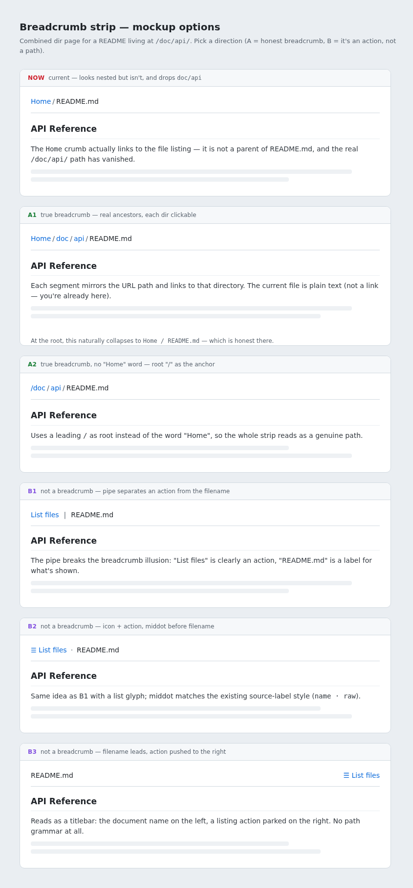
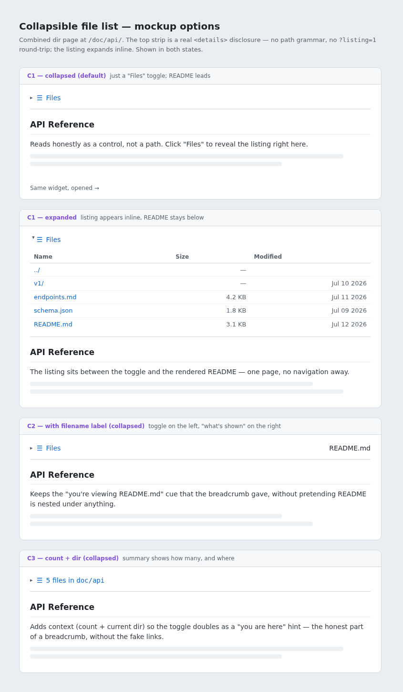
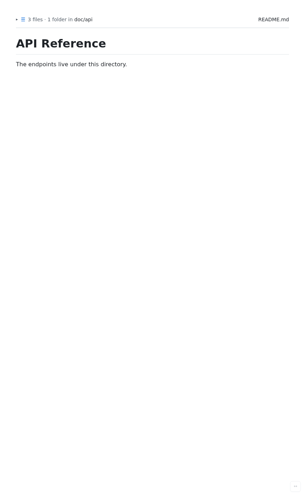
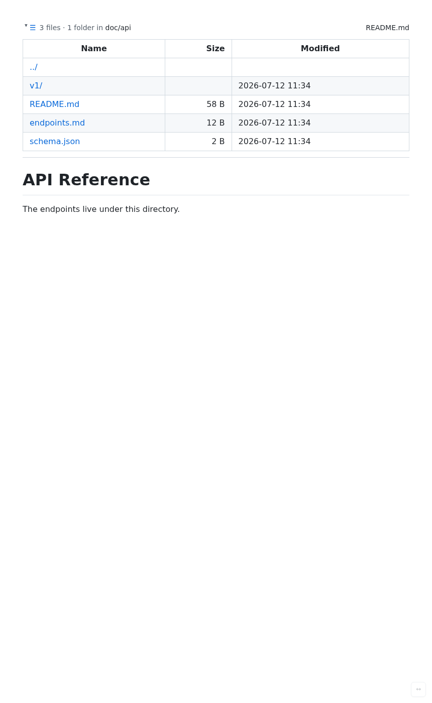

<!-- agent-chat export
title: Collapsible File List Dir Page
date: 2026-07-12
index: 01
slug: collapsible-file-list-dir-page
agent: claude
version: 0.8.10 (80c7515)
-->

# Collapsible File List Dir Page

_2026-07-12 · 01 · claude · agent-chat 0.8.10 (80c7515)_

**USER**

> Sorry our latest change to render `Home / README.md` is too misleading.
> - if it’s true breadcrumb it should show real nesting like ` Home / doc / README.md`
> - if it’s not, then it should not look like it, eg `List files | README.md`
>
> Mockup options

<small>took 2m 22s</small> 
**AGENT**

> You're right — the current strip borrows breadcrumb grammar (slashes) but "Home" isn't a real ancestor, and at a nested dir like `/doc/api/` it silently drops `doc/api`. Here are mockups in two honest directions (screenshot attached):
>
> **Direction A — make it a real breadcrumb** (I can build this; `urlPath` is already available in `serveCombinedDir`, so real ancestors are trivial)
> - **A1** `Home / doc / api / README.md` — every dir segment links to that directory's page; the current file is plain (non-link) text. Collapses to `Home / README.md` at the root, which is honest there.
> - **A2** `/ doc / api / README.md` — same, but a leading `/` stands in for "Home" so the whole thing reads as a genuine path.
>
> **Direction B — stop looking like a breadcrumb** (it's an action + a label, not a path)
> - **B1** `List files | README.md` — pipe makes "List files" read as an action.
> - **B2** `☰ List files · README.md` — list glyph + middot (middot matches the existing `name · raw` source label).
> - **B3** `README.md` … `☰ List files` — filename leads, action parked on the right like a titlebar. No path grammar at all.
>
> My pick: **A1** — it fixes the dishonesty *and* adds real navigation (click any ancestor). B1/B2 are the lightest touch if you'd rather not render ancestors at all.
>
> Which do you want?
>
> 

> 
> 

[Quick replies]
- A1 — true breadcrumb
- A2 — /-rooted breadcrumb
- B1 — List files | README.md
- B2 — ☰ List files · README.md
- B3 — filename + right action

**USER**

> B2 — ☰ List files · README.md

**USER**

> Stop

<small>took 17.4s</small> 
**AGENT**

> Stopped. I was mid-implementing B2 (`☰ List files · README.md`). Partial state in `main.go` — these edits are already made:
>
> ✅ `serveCombinedDir` HTML → emits `☰ List files · README.md` (renamed class `md-serve-breadcrumb` → `md-serve-dirbar`; filename is now a plain label, not a link)
> ✅ Light-mode CSS + dark-mode chrome rules renamed/restyled
> ✅ Two code comments updated
>
> Still NOT done (so it won't build clean yet):
> ⬜ `-help` text still says "Home / <file> breadcrumb" (main.go ~350)
> ⬜ `serveDir` comment still refers to the "Home" breadcrumb (main.go ~530)
> ⬜ Tests still assert `md-serve-breadcrumb` / "Home" (main_test.go ~325, ~374) — will fail until updated
> ⬜ No build/test run yet
>
> How do you want to proceed?

[Quick replies]
- Finish B2 (comments + tests + build)
- Revert everything
- Leave as-is, I'll take over
- Something else

**USER**

> How is A2 supposed to view room directory? I only see /doc 
>
> Otherwise maybe A1 is better

<small>took 17.4s</small> 
**AGENT**

> Good catch — that's a flaw in my A2 mockup, not something inherent. In A2 the leading `/` *is* the root/home link, but I rendered it glued to `doc` (`/doc`) with no separator, so it reads as one token and the root isn't visibly clickable. It'd have to be `/ · doc / api / README.md` to work, which is awkward.
>
> A1 avoids all that: an explicit **`Home`** is unmistakably the root, then real ancestors. So yes — A1 is the cleaner honest breadcrumb.
>
> To be clear, this switches away from B2. I've made some B2 edits already; I'll revert those and implement **A1** instead:
> `Home / doc / api / README.md` — each dir segment links to that directory, current file is plain text, collapses to `Home / README.md` at root.
>
> Switch to A1?

[Quick replies]
- Yes — revert B2, do A1
- No, keep B2
- Wait — let me think

**USER**

> Yes — revert B2, do A1

**USER**

> Stop

<small>took 13.3s</small> 
**AGENT**

> Stopped. Nothing new written this turn — `main.go` still has the partial **B2** edits (renamed class `md-serve-dirbar`, `☰ List files · README.md` markup, 2 comments). No A1 work started, no revert done yet. Tests still reference old `md-serve-breadcrumb`, so it won't build clean as-is.
>
> How do you want to proceed?

[Quick replies]
- Revert B2, implement A1
- Revert everything to clean
- Leave as-is, I'll take over
- Something else

**USER**

> Maybe the top section is a collapsible file list instead? Mockups?

<small>took 1m 3s</small> 
**AGENT**

> Collapsible-file-list mockups (screenshot). The top strip becomes a real `
` disclosure — honest (it's a control, not a path), and the listing expands **inline** so there's no `?listing=1` navigation away.
>
> - **C1** — bare `▸ ☰ Files` toggle. Collapsed by default, README leads; expanded shows the listing table inline (see 2nd card), README stays below.
> - **C2** — `▸ ☰ Files … README.md` — keeps the "you're viewing README.md" cue on the right, without the fake nesting.
> - **C3** — `▸ ☰ 5 files in doc/api` — summary carries count + current dir, so it doubles as a real "you are here" hint (the honest half of a breadcrumb, no fake links).
>
> Trade-off vs A1: this drops per-ancestor navigation (can't click up to `/doc`) but is simpler and fully honest. If you want both "where am I" *and* jump-to-ancestor, A1's breadcrumb still wins on that.
>
> My pick here: **C3** — most information, still honest. Which do you want? (Or combine — e.g. C2's filename label + C3's count.)
>
> 

> 
> 

[Quick replies]
- C3 — count + dir
- C1 — bare Files toggle
- C2 — Files + filename
- Combine C2 + C3
- Actually go back to A1 breadcrumb
- Something else

**USER**

> Combine C2 + C3

**USER**

> Though it’s confusing if the count includes directory and/or parent for ..

**USER**

> Stop

<small>took 18.2s</small> 
**AGENT**

> Fair — "N files" is ambiguous when the listing also contains subdirs and the `../` parent. No code written. Ways to make the count honest (or avoid it):
>
> 1. **"N items"** — count everything listed except `../` (files + subdirs together). Honest umbrella word. → `☰ 8 items in doc/api`
> 2. **"N files · M folders"** — split them out explicitly. → `☰ 5 files · 3 folders in doc/api`
> 3. **Drop the count entirely** — just `☰ Files in doc/api` (no number to misread). Simplest.
> 4. **Keep "files" but exclude dirs + `..`** — count only regular files; but then the number won't match the rows you see when expanded (I'd avoid this — it's the confusing one).
>
> `../` is never counted in any of these (it's navigation, not content).
>
> My pick: **#1 "N items"** (honest, compact) or **#3 drop it** if you'd rather not reason about counts at all. Which way?

[Quick replies]
- #1 — N items
- #3 — drop the count
- #2 — files · folders split
- Something else

**USER**

> #2 — files · folders split

<small>took 5m 52s</small> 
**AGENT**

> Done — implemented the combined C2+C3 collapsible file list, replacing the misleading breadcrumb. Screenshots are the real server at `/doc/api/` (collapsed + expanded).
>
> **Behavior**
> - Top strip is a real `
` — collapsed by default: `▸ ☰ 3 files · 1 folder in doc/api … README.md`. README leads.
> - Expand → the full listing table drops in **inline** (no `?listing=1` navigation away); README stays below.
> - Counts split files vs folders, pluralized ("1 folder"), `../` never counted, empty dir reads "empty".
> - Root omits the "in …" clause (no `in /`). Nested dirs show the path.
> - Light + dark both verified.
>
> **Changed** (`main.go`)
> - `serveCombinedDir` now emits the `
` disclosure + inline listing.
> - `listingHTML` also returns file/folder counts; new `dirCountSummary` helper.
> - New `.md-serve-files` CSS (light + dark), old `md-serve-breadcrumb` styles removed.
> - `-help` text and stale breadcrumb comments updated.
>
> **Tests** — green (`go test`, `go vet` clean). Rewrote the breadcrumb test into two: collapsible-list-at-root and nested-dir-summary; updated the `?listing=1` negative assertion.
>
> Want me to keep it as-is, tweak wording/glyph, or default the list to open? (I left review screenshots in the repo root — `mockup*-shot.png`, `real-*.png` — say the word and I'll delete them.)
>
> 

> 
> 
> 

[Quick replies]
- Looks good, keep it
- Delete the screenshot artifacts
- Default the list to open
- Tweak the wording
- Commit this

**USER**

> Looks good, keep it

<small>took 20.6s</small> 
**AGENT**

> Great — it's in. Working tree now shows only the real change: `main.go` + `main_test.go` (M). I removed my throwaway review screenshots; the pre-existing `dark-*.png` / `light-*.png` are untouched.
>
> Tests green, `go vet` clean. Nothing committed — say the word when you want me to commit (and I can run /npm-login-and-publish for a release if you'd like it out).

[Quick replies]
- Commit it
- Commit + release
- Leave uncommitted
- I'll take it from here

**USER**

> Commit it

**USER**

> /ck:export-chat-logs

<small>took 10.8s</small> 
**AGENT**

> Committed on `main`:
>
> **3512bce** — Replace README breadcrumb with a collapsible file list
>
> Only `main.go` + `main_test.go` are in the commit; the untracked artifacts (`.pi/`, `.playwright-mcp/`, `CLAUDE.md`, the `dark-*/light-*` pngs, the `md-serve` binary) were left alone. Not pushed.
>
> Want me to push, or cut a release with /npm-login-and-publish?

