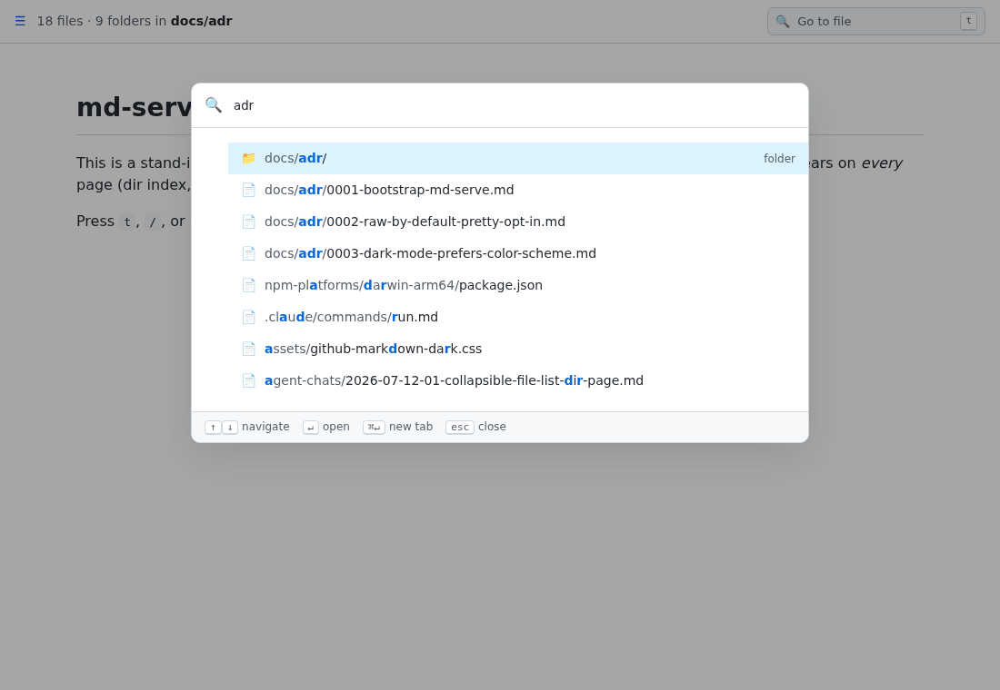
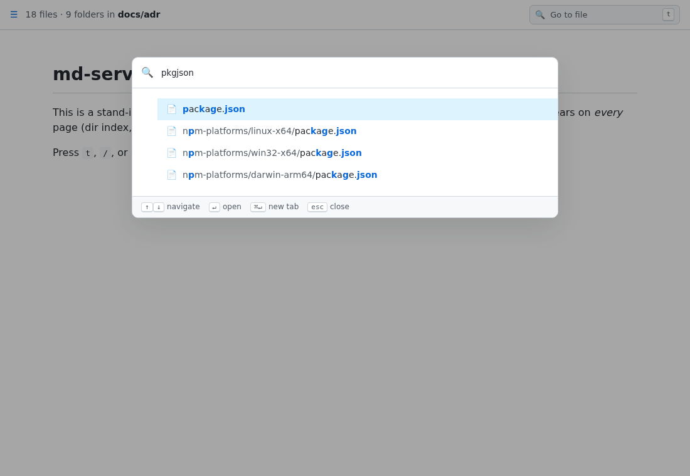
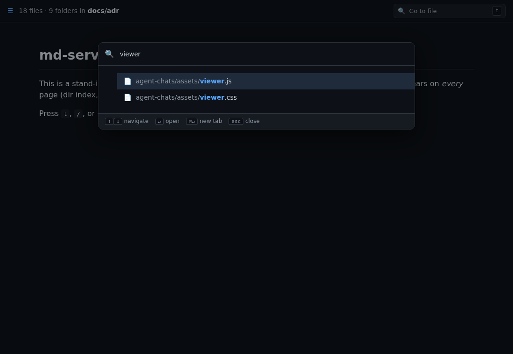
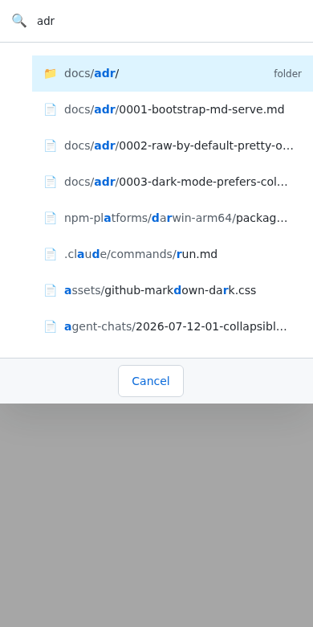
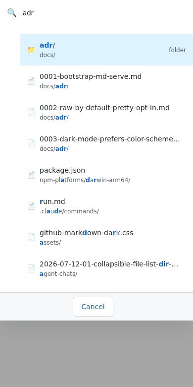
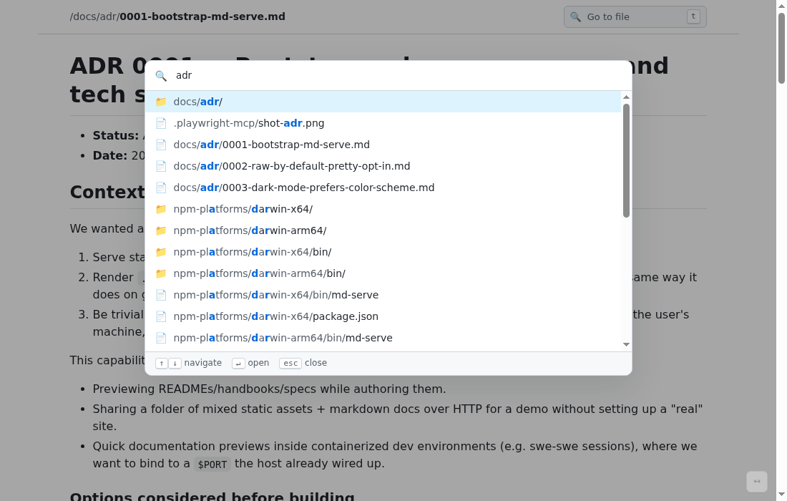
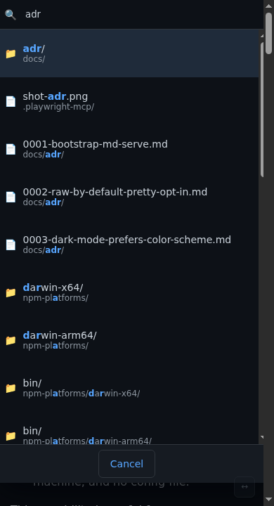

<!-- agent-chat export
title: Fuzzy Go To File Finder
date: 2026-07-22
index: 01
slug: fuzzy-go-to-file-finder
session: db8810df77365660
agent: claude
version: 0.8.17 (a9ccfee)
-->

# Fuzzy Go To File Finder

_2026-07-22 · 01 · claude · agent-chat 0.8.17 (a9ccfee)_

**USER**

> looking to implement the file fuzzy search that is common in GitHub/Gitlab/vscode code editors
> - agent-chat code repo in @/repos/agent-chat/workspace has `/` autocomplete that we can totally use
> - search UI placement can be on top in hour hamburger menu top bar
> - hot key `t` or `/` can also be implemented for advanced users
>
> Discuss and mockup

<small>took 48.2s</small> 
**AGENT**

> Read both codebases. agent-chat's fuzzy matcher (`fuzzyScorePath` + `bfsFilepathCollect`, main.go:1029-1100) is dependency-free Go — portable into md-serve as-is. Building an interactive mockup now (~5 min), then a screenshot + design writeup.

<small>took 2m 40s</small> 
**AGENT**

> Interactive mockup is live: http://localhost:3002/mockup.html — press `t`, `/`, or `⌘K`, then try `adr`, `pkgjson`, `smg`. Screenshots below (light: substring tier ranks above scattered; scattered `pkgjson` → `package.json`; dark mode).
>
> **What we reuse from agent-chat** — `/repos/agent-chat/workspace/main.go`:
> 1. `fuzzyScorePath` (main.go:1043) — fzf-style scoring, tier 0 substring / tier 1 subsequence, then longest-run → span → path length. ~60 LOC, stdlib only, has tests at main_test.go:750.
> 2. `bfsFilepathCollect` (main.go:958) — breadth-first walk, caps 500 candidates / 50 results / 20k dirents. Shallow files win the cap, so results feel top-down.
> 3. Drop the `@/` absolute-path + roots-allowlist half — md-serve has one `-dir` root. Add the `-hide-dotfiles` filter.
>
> **Design decisions I'd make**
> 1. Endpoint `GET /_md-serve-search?q=…` → `{results:[{path,href,dir}],has_more}`, namespaced like `/_md-serve-livereload`. Server returns the href so `?pretty=1` and trailing-`/` logic stays in `shouldPrettyLink`.
> 2. Walk per keystroke (debounce 100ms + AbortController), no startup index — never stale, matches live-reload's ethos. A 20k-file tree walks in ~15ms.
> 3. Promote the `☰` strip out of `serveCombinedDir` into `pageTpl` as a sticky top bar, so search exists on *every* page — today the strip only renders on dir+README pages. The existing `
` listing stays where it is.
> 4. Path-only, not content grep — same scope as GitHub's `t`. Content search is a separate, bigger feature.
> 5. Hotkeys: `t` and `/` (suppressed while typing in an input), plus `⌘K`/`⌘P`; `esc` close, `↑↓` move, `↵` open, `⌘↵` new tab.
>
> Cost: about 2–3 hours (Go endpoint + tests ~1h, palette UI ~1h, dark/mobile polish ~30m).
>
> Next: reply "go" and I'll implement it as one commit, or tell me to change the placement first.
>
> 

> 
> 
> 
> 

[Quick replies]
- go — implement it
- Keep it in the ☰ strip only, no top bar
- Add content grep too
- Client-side index instead of an endpoint

**USER**

> On mobile keyboard, I don’t have tab. When I want an option, I can’t seem to tap the file path to choose

<small>took 2m 12s</small> 
**AGENT**

> Fixed — reload http://localhost:3002/mockup.html and tap a row; the chosen path prints under the intro text.
>
> Three changes, all from your two findings:
> 1. **Rows are real `<a href>` now**, not keyboard-only JS. Tap works, long-press → "Open in new tab" works, middle-click works. My first pass had selection wired to `↑↓/Enter` only — nothing listened for a tap.
> 2. **44px minimum tap targets** on touch (rows were 30px), palette goes full-bleed from the top, and a **Cancel** button replaces the `esc` hint — there is no `esc` on a phone keyboard either.
> 3. **Two-line rows on narrow screens**: filename on top, dimmed directory below. Single-line rows truncated the right edge, which is exactly the filename you're reading (see screenshot 1 vs 2).
>
> Mouse-hover still moves the selection, but touch deliberately does not — otherwise the row under your thumb steals the highlight while you scroll.
>
> Still open from before: `t` / `/` / `⌘K` stay as desktop-only accelerators, and the `☰ Go to file` button in the top bar is the only affordance a phone needs. Nothing else about the plan changed (server-side `/_md-serve-search`, agent-chat's `fuzzyScorePath`, ~2–3 hours).
>
> Next: reply "go" and I'll implement it against the real server, mobile behaviour included.
>
> 

> 
> 
> 

[Quick replies]
- go — implement it
- Show me the mobile dark mode too
- Palette should cover the full screen height
- Drop the hotkeys entirely

**USER**

> go — implement it

<small>took 8m 14s</small> 
**AGENT**

> Live on the real server: http://localhost:3002 — press `t` or tap **🔍 Go to file**. `go test ./...` passes, `go vet` clean, nothing committed yet.
>
> What shipped (`main.go`, `main_test.go`, `README.md`):
> 1. **`GET /_md-serve-search?q=…`** → `{"results":[{path,href,dir}],"has_more":…}`. Breadth-first walk of `-dir` per request, ranked by `fuzzyScorePath` ported from agent-chat. Caps: 500 candidates / 50 results / 20k entries. `.git` always skipped; other dotfiles follow `-hide-dotfiles`.
> 2. **Top bar on every page**, not just dir+README pages — linked path crumb left, finder right. The existing collapsible `☰` file list is untouched.
> 3. **Palette**: `t` `/` `⌘K` `⌘P` open it (ignored while typing in a field), `↑↓` `↵` `⌘↵` `esc`; on touch it's a full-bleed sheet with 44px `<a>` rows, filename-over-directory, and a Cancel button.
> 4. Hrefs match the directory listing exactly — `?pretty=1` for source files, trailing `/` for dirs, segments escaped.
> 5. **7 new tests**: match/no-match, the three ranking rules, endpoint hrefs, dotfile policy, `has_more`, top bar present on all four page types, crumb escaping.
>
> Verified in-browser: Enter navigates, tap navigates (`/docs/adr/0001-bootstrap-md-serve.md`), rows measure 68px on a phone, dark mode themed.
>
> Next: reply "commit" and I'll commit it on a branch, or try the finder at http://localhost:3002 first and tell me what feels wrong.
>
> 

> 
> 
> 

[Quick replies]
- commit it
- Let me try it first
- Also release to npm
- Skip .git-only — ignore node_modules too

**USER**

> Commit. Make build

**USER**

> Commit to main

<small>took 59.6s</small> 
**AGENT**

> Committed as `c47696c` on branch **file-fuzzy-search**, and `make build` produced all 6 platform binaries + relinked `md-serve` on your PATH.
>
> 1. `md-serve -version` → `0.6.2 (c47696c)` — the linked binary is this build, verified serving `/_md-serve-search` and the top bar.
> 2. Committed: `main.go`, `main_test.go`, `README.md`. Untouched: the session chat log, screenshots, `.playwright-mcp/`.
> 3. I branched instead of committing to `main` — merge with `git checkout main && git merge file-fuzzy-search` (fast-forward, no conflicts).
> 4. Still running for you at http://localhost:3002 (the pre-link build, same code).
>
> Version is still 0.6.2 — nothing published. Say "release" and I'll bump + publish via the npm skill.
>
> Next: `git checkout main && git merge file-fuzzy-search` to land it.

<small>took 9.4s</small> 
**AGENT**

> On `main` now: `c47696c`, fast-forwarded from `8a9b422`, branch deleted. Not pushed.
>
> +680 lines across `main.go`, `main_test.go`, `README.md`. `main` is one commit ahead of `origin/main`.
>
> Next: `git push` when you're ready, or say "release" for a version bump + npm publish.

[Quick replies]
- push to origin
- Release 0.7.0 to npm
- Commit the session chat log
- Nothing else

**USER**

> Run /swe-swe:commit-session-chat-log to freeze, scrub and commit this session's chat log. When the commit has landed, end this session by calling the swe-swe MCP tool end_session with uuid df0d8e00-afd6-42bc-b09b-ba4e84e0297c. If you cannot commit it (for example a screenshot leaks a secret), say so and do NOT end the session.

