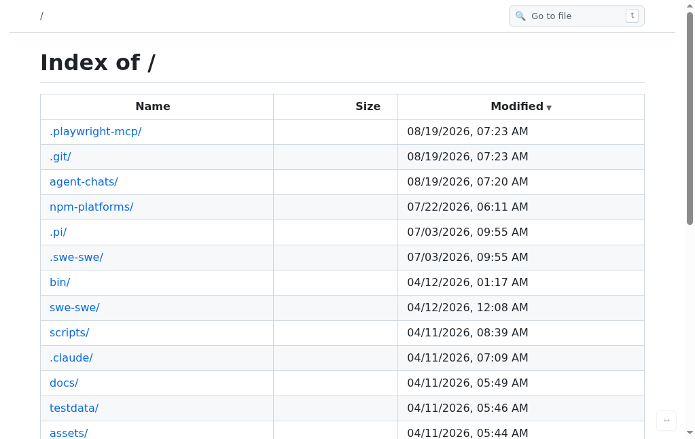

<!-- agent-chat export
title: Listing Timezone And Sortable Columns
date: 2026-08-19
index: 01
slug: listing-timezone-and-sortable-columns
session: 6120b31b465e2a1a
agent: claude
version: 0.11.0 (01f4c81)
-->

# Listing Timezone And Sortable Columns

_2026-08-19 · 01 · claude · agent-chat 0.11.0 (01f4c81)_

**USER**

> File listing’s timestamp should be in user browser timezone and allow sorting for all columns

<small>took 9.7s</small> 
**AGENT**

> Finding the file-listing page code to add browser-timezone timestamps and sortable columns.

<small>took 33.1s</small> 
**AGENT**

> Found the listing code in main.go. Writing the timezone conversion + column sorting now.

<small>took 1m 20s</small> 
**AGENT**

> Build + tests pass. Starting the server to check it in a browser.

<small>took 2m 12s</small> 
**AGENT**

> Run `make run` (or restart md-serve) and open any folder page — click a column heading to sort.
>
> Both parts are done and tested.
>
> 1. **Times now follow your browser.** The server sends the exact moment a file changed; your browser prints it in whatever timezone and date format your computer is set to. Hover a time to see the full date with the timezone spelled out.
> 2. **All three columns sort.** Click Name, Size, or Modified to sort by it; click the same one again to flip the order. First click gives you the order people usually want: names A–Z, biggest files first, newest changes first.
> 3. **Small niceties.** Folders stay grouped above files in every order, the `../` row stays pinned at the top, an arrow marks the column being sorted, and your choice is remembered as you move between folders.
> 4. **Nothing breaks without JavaScript.** The table still shows, sorted by name, with the server's own clock.
>
> Changed: `main.go` (listing markup, styles, the sorting script), `main_test.go` (new test), `README.md`. `go test ./...` passes.
>
> Screenshot below is the root folder sorted by Modified, newest first.
>
> Next: want me to commit this?
>
> 

> 
> 

[Quick replies]
- Yes, commit it
- Not yet — let me look first
- Also remember the sort per folder

**USER**

> commit and make build

<small>took 9.0s</small> 
**AGENT**

> Committing the listing timezone + sortable columns change, then running `make build`.

<small>took 44.7s</small> 
**AGENT**

> Run `md-serve` — the freshly linked 0.7.0 (0d89a4f) binary is on your PATH.
>
> Both steps done.
>
> 1. **Committed** `0d89a4f feat(listing): local timezone timestamps and sortable columns` — `main.go`, `main_test.go`, `README.md` only. Nothing pushed.
> 2. **`make build` passed** — all 6 platform binaries built (linux/darwin/windows × amd64/arm64) and `npm link` re-pointed `md-serve` at this build. `go test ./...` passes.
>
> Still untracked and left alone: the 5 stray `*-before/after.png` screenshots at repo root, `CLAUDE.md`, the local `md-serve` binary, `.pi/`, `.playwright-mcp/`.
>
> Next: open a folder page under the new binary and click a column heading to confirm the sort survives the rebuild.
>
> Separately: those 5 root-level PNGs and the local `md-serve` binary look like debris — want me to gitignore or delete them?

[Quick replies]
- Gitignore the debris
- Delete the PNGs and binary
- Leave them, push the commit
- Nothing more for now

**USER**

> /commit-log-then-end

<small>took 2.4s</small> 
**AGENT**

> Running /commit-log-then-end: freezing the chat log, scrubbing, committing it, then ending the session.

